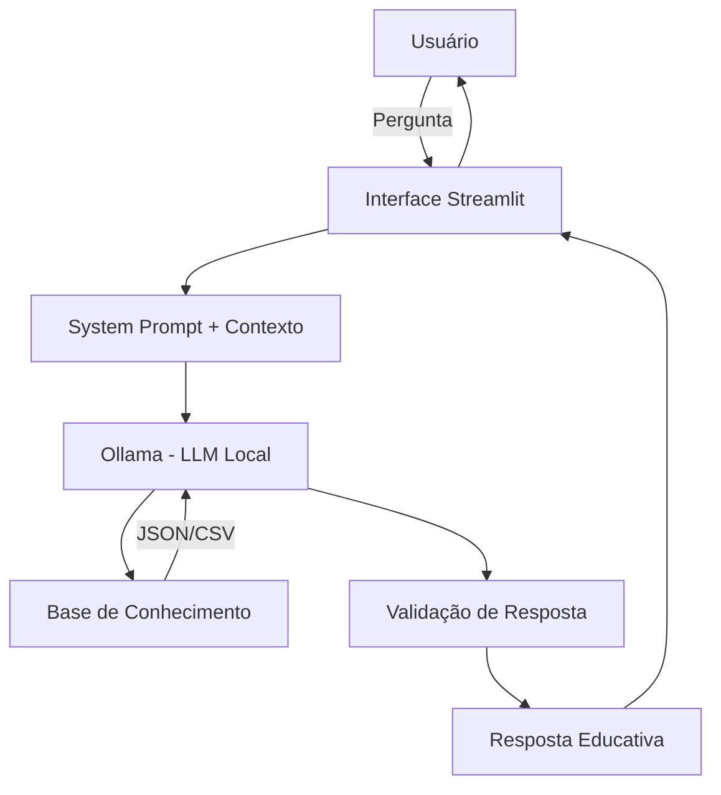

# 🤖 EduFin - Agente de Educação Financeira com IA

> Projeto desenvolvido como parte do curso "Bradesco Gen AI Data Course" na plataforma DIO (Digital Innovation One)

## 📚 Sobre o Projeto

Este projeto foi desenvolvido como desafio prático do bootcamp de IA Generativa oferecido pelo Bradesco em parceria com a DIO. O objetivo era criar um agente inteligente que auxiliasse usuários no contexto financeiro, utilizando tecnologias de IA Generativa.

Ao invés de criar apenas mais um consultor de investimentos, decidi focar em algo que considero mais necessário: **educação financeira acessível**. Muitas pessoas têm dificuldade em entender conceitos básicos como a diferença entre débito e crédito, o que é uma reserva de emergência, ou como funcionam diferentes tipos de investimento.

### 💡 O Problema

A maioria dos brasileiros não teve educação financeira formal, o que gera:
- Dificuldade em entender produtos financeiros básicos
- Medo de investir por falta de conhecimento
- Gastos desorganizados e falta de planejamento
- Dependência de terceiros para decisões financeiras simples

### ✨ A Solução: EduFin

**EduFin** é um agente educativo que:
- ✅ Explica conceitos financeiros de forma simples e didática
- ✅ Usa os dados do próprio cliente como exemplos práticos
- ✅ NÃO faz recomendações de investimento (foca em educar)
- ✅ Mantém um tom acessível e sem julgamentos
- ✅ Admite quando não sabe algo (anti-alucinação)

---

## 🎯 Funcionalidades

- **Explicações Contextualizadas**: Usa os dados reais do cliente para exemplificar conceitos
- **Análise de Gastos Educativa**: Mostra padrões de consumo de forma didática
- **Conceitos Financeiros**: Explica termos como CDI, Selic, CDB, Tesouro Direto, etc.
- **Histórico de Conversas**: Mantém contexto de atendimentos anteriores
- **Interface Amigável**: Chat interativo via Streamlit

---

## 🏗️ Arquitetura



### 🔧 Stack Tecnológico

- **Frontend**: Streamlit (interface web interativa)
- **LLM**: Ollama com modelo local `gpt-oss`
- **Dados**: JSON + CSV (perfil, transações, histórico, produtos)
- **Linguagem**: Python 3.x

---

## 📂 Estrutura do Projeto

```
dio-lab-bia-do-futuro/
│
├── 📄 README.md                      # Este arquivo
│
├── 📁 data/                          # Base de conhecimento
│   ├── historico_atendimento.csv     # Atendimentos anteriores
│   ├── perfil_investidor.json        # Perfil do cliente (João Silva)
│   ├── produtos_financeiros.json     # Produtos financeiros disponíveis
│   └── transacoes.csv                # Histórico de transações
│
├── 📁 docs/                          # Documentação completa
│   ├── 01-documentacao-agente.md     # Caso de uso e arquitetura
│   ├── 02-base-conhecimento.md       # Estratégia de dados
│   ├── 03-prompts.md                 # Engenharia de prompts
│   └── 04-metricas.md                # Testes e avaliação
│
└── 📁 src/                           # Código fonte
    ├── app.py                        # Aplicação Streamlit
    └── requirements.txt              # Dependências Python
```

---

## 🚀 Como Executar

### Pré-requisitos

1. **Python 3.8+** instalado
2. **Ollama** instalado e rodando localmente ([ollama.ai](https://ollama.ai))
3. Modelo `gpt-oss` baixado no Ollama:
   ```bash
   ollama pull gpt-oss
   ```

### Instalação

1. Clone este repositório:
   ```bash
   git clone https://github.com/seu-usuario/dio-lab-bia-do-futuro.git
   cd dio-lab-bia-do-futuro
   ```

2. Crie um ambiente virtual:
   ```bash
   python3 -m venv venv
   source venv/bin/activate  # No Windows: venv\Scripts\activate
   ```

3. Instale as dependências:
   ```bash
   pip install -r src/requirements.txt
   ```

4. Execute a aplicação:
   ```bash
   streamlit run src/app.py
   ```

5. Acesse no navegador: `http://localhost:8501`

---

## 💬 Exemplos de Uso

### Exemplo 1: Explicando Conceitos
**Você:** "O que é CDI?"

**EduFin:** "O CDI (Certificado de Depósito Interbancário) é a taxa de juros praticada em empréstimos de curtíssimo prazo entre bancos. Funciona como a principal referência de rentabilidade para renda fixa no Brasil, como CDBs e LCIs. Ele acompanha de perto a Taxa Selic."

### Exemplo 2: Análise Educativa de Gastos
**Você:** "Onde estou gastando mais?"

**EduFin:** "Olhando suas transações do último mês, sua maior despesa é moradia (R$1.380), seguida de alimentação (R$570). Juntas, representam quase 80% dos seus gastos. Isso é bem comum! Quer que eu explique algumas estratégias de organização?"

### Exemplo 3: Limites Claros
**Você:** "Onde devo investir meu dinheiro?"

**EduFin:** "Não posso recomendar investimentos específicos, mas posso te explicar como cada tipo funciona! Por exemplo, você quer entender mais sobre renda fixa ou renda variável?"

---

## 📊 Base de Conhecimento

O agente utiliza dados mockados de um cliente fictício (João Silva) para demonstrar funcionalidades:

- **Perfil**: Analista de Sistemas, 32 anos, perfil moderado
- **Objetivo**: Construir reserva de emergência e poupar para entrada de apartamento
- **Renda**: R$ 5.000/mês
- **Patrimônio**: R$ 15.000
- **Produtos**: Tesouro Selic, CDB, LCI/LCA, Fundos Imobiliários

Todos os dados estão em [data/](data/) e podem ser adaptados.

---

## 🎓 O Que Aprendi

Este projeto me permitiu explorar:

1. **Engenharia de Prompts**: Como criar instruções claras e eficazes para LLMs
2. **RAG (Retrieval-Augmented Generation)**: Injetar contexto relevante no prompt
3. **Ollama**: Rodar modelos de IA localmente, sem depender de APIs externas
4. **Streamlit**: Criar interfaces web rapidamente com Python
5. **Anti-Alucinação**: Técnicas para manter o agente dentro do escopo de conhecimento
6. **UX para IA**: Como projetar interações naturais e úteis

---

## 🔒 Segurança e Limitações

### Medidas de Segurança
- ✅ O agente só usa dados fornecidos explicitamente
- ✅ Admite quando não sabe algo
- ✅ Não faz recomendações financeiras (apenas educação)
- ✅ Não acessa dados sensíveis (senhas, tokens, etc.)

### Limitações Conhecidas
- ⚠️ Modelo local pode ter respostas mais lentas que APIs comerciais
- ⚠️ Base de conhecimento limitada aos arquivos mockados
- ⚠️ Não substitui um educador financeiro certificado
- ⚠️ Interface básica (MVP para demonstração)

---

## 📖 Documentação Completa

Para detalhes técnicos, consulte:

- [📋 Documentação do Agente](docs/01-documentacao-agente.md) - Caso de uso e arquitetura
- [💾 Base de Conhecimento](docs/02-base-conhecimento.md) - Como os dados são usados
- [🎨 Prompts](docs/03-prompts.md) - Engenharia de prompts e exemplos
- [📊 Métricas](docs/04-metricas.md) - Como avaliei o agente

---

## 🙏 Agradecimentos

- **DIO (Digital Innovation One)** - pela plataforma e bootcamp
- **Bradesco** - pelo patrocínio do curso
- Instrutores e comunidade da DIO que compartilharam conhecimento

---

## 📝 Licença

Este é um projeto educacional desenvolvido para fins de aprendizado. Sinta-se livre para usar como referência ou base para seus próprios projetos.

---

## 👤 Autor

Desenvolvido como projeto de conclusão do Bradesco Gen AI Data Course na DIO.

Se este projeto te ajudou de alguma forma, considere deixar uma ⭐ no repositório!

---

**⚠️ Aviso Legal**: Este é um projeto educacional. Não constitui consultoria financeira. Sempre busque orientação de profissionais certificados para decisões financeiras importantes.
